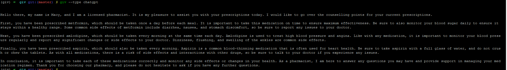
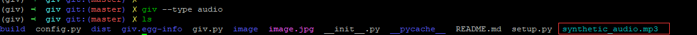
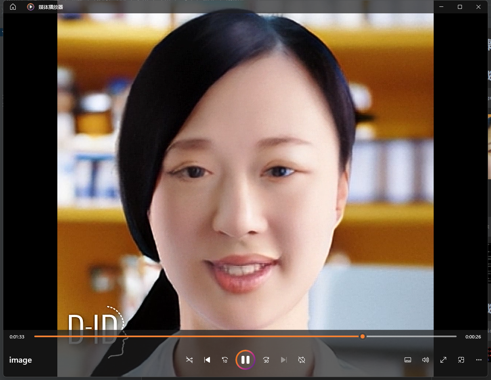

giv:Generative AI Vedio
=======================

This is a collection of generative AI video.

本项目参考[Generative-AI-Pharmacist](https://github.com/kennethleungty/Generative-AI-Pharmacist),将会使用python实现giv命令，以实现生成式AI视频

- 图像生成，使用openai的[图像生成](https://platform.openai.com/docs/guides/images)接口
- ChatGPT问答，使用[GPT3.5](https://platform.openai.com/docs/guides/chat)
- 语音合成，使用gtts
- 视频生成，使用[D-ID](https://studio.d-id.com/editor)接口

在使用giv工具之前，首先应该安装openai和gtts

```bash
pip install openai
pip install gtts
```

然后购买D-ID的API服务，才能够使用视频生成功能，[购买地址](https://www.d-id.com/pricing/)

config.py文件中存储的是openai key和did key，以及第一步生成图像时的描述和第二步提问时的问题。

克隆项目

```bash
git clone https://github.com/yingluofeihua/giv.git
```

加入环境变量

```bash
export PYTHONPATH=$PYTHONPATH:/path/to/giv
```

或者直接通过pip下载

```bash
pip install giv
```

-----

# 使用步骤

## 1.图像生成

```bash
giv --type image
```


## 2.问答

```bash
giv --type chat
```



## 3.语音合成

```bash
giv --type audio
```



## 4.视频生成

在DID中，可以生成多种风格的视频，这里，仅封装了2种风格的视频生成，分别是：演讲模式和合唱模式。

合唱模式

```bash
giv --type singing
```

演讲模式

```bash
giv --type talk
```




