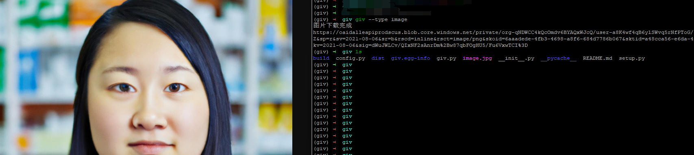

giv:Generative AI Vedio
=======================

This is a collection of generative AI video.

本项目将会使用python实现giv命令，以实现生成式AI视频

- 图像生成，使用openai的[图像生成](https://platform.openai.com/docs/guides/images)接口
- ChatGPT问答，使用[GPT3.5](https://platform.openai.com/docs/guides/chat)
- 语音合成，使用gtts
- 视频生成，使用[D-ID](https://studio.d-id.com/editor)接口

在使用giv工具之前，首先应该安装openai和gtts

```bash
pip install openai
pip install gtts
```

然后购买D-ID的API服务，才能够使用视频生成功能，[购买地址](https://www.d-id.com/pricing/)

config.py文件中存储的是openai key和did key，以及第一步生成图像时的描述和第二步提问时的问题。

使用时，先下载项目

git 

-----

# 步骤

## 1.图像生成

```bash
giv --type image
```




